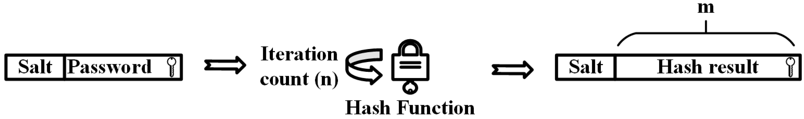

# Validator-Backend
## Marco teorico (Inglés)

### Contraseñas  

A password constitutes a user-memorable secret that consists of a few printable characters. Passwords are the common choice in computer systems for user authentication. The system stores the user’s identity and password for every account. Then, the user logins this data to authenticate himself and access the service.

The ordinary choice to provide protection against such attacks is key stretching. Cryptographic hash functions  constitute a security primitive type that parses input of arbitrary size and outcomes a digest of fixed length. In the password-hashing domain, the password is parsed to a hash function which results an output of fixed length, which then acts as the password. Some attacks become computational infeasible as the result is longer than the original secret (e.g., 32 or 64 bytes). 

**The hash function is iterated a few times in order to further fortify the hashed password.**

If many users possess the exact same passphrase, the hash results will be the same too. When one of these passwords is exposed, the credentials of all users might be disclosed. Similarly, as one user can apply the same secret in many accounts or use the same login platform (i.e., the Facebook social login platform) for many applications, the disclosure of one of these accounts raises concerns about the security of the rest involving services.

**Thus, a salt parameter is utilized (a small value, usually consisting of 8 random bytes). During the creation of a new account, a random salt is generated which is concatenated with the passphrase during hashing.**

The same secret produces different hashes for different accounts and the correlation of simple hashed passwords that are generated by the same passphrase is prevented. Ordinary, the salt is kept along with the hashed secret, in plaintext. The authentication operation parses the salt and the password of a login procedure, and compares the result with the stored password hash value to validate the user. 

## Aviso de Seguridad

**Nota:** Este código se proporciona solo con fines educativos y de práctica. Antes de implementar cualquier parte de este código en un entorno de producción, se recomienda encarecidamente realizar una revisión exhaustiva de las medidas de seguridad.